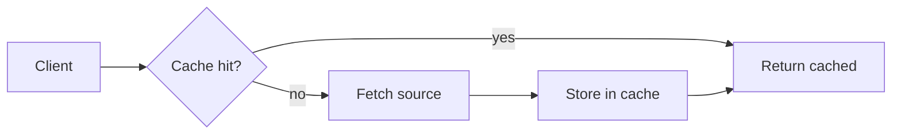

# Technical spec: Feature name

**Status:** Draft · **Author:** Your Name · **Last updated:** 2026-01-01

## Summary

One paragraph on the problem and the proposed solution.

## Goals and non-goals

- **Goal:** what this must achieve.
- **Non-goal:** what is explicitly out of scope.

## Design

Describe the approach here. The flow below is a [Mermaid](https://mermaid.js.org) diagram,
which renders as a real diagram in tools that support it.

## Data model

| Field | Type | Required | Notes |
|-------|------|----------|-------|
| `id` | string | yes | Primary key. |
| `created_at` | datetime | yes | UTC. |
| `payload` | object | no | Free-form metadata. |

## Performance target

The cache hit ratio $H$ over $n$ requests is:

$$H = \frac{\text{hits}}{\text{hits} + \text{misses}}$$

We aim for $H \ge 0.9$ at steady state.

## Rollout

1. Ship behind a flag.
2. Enable for 10% of traffic.
3. Measure, then ramp to 100%.

## Open questions

- Anything still undecided.
